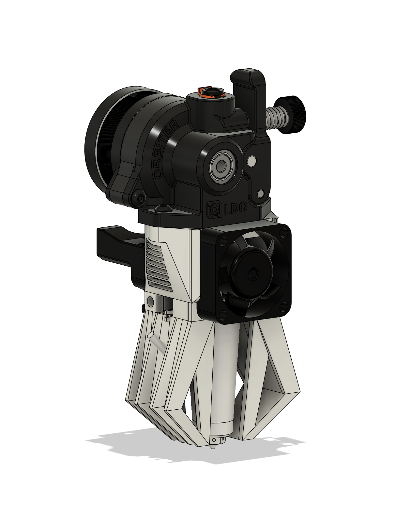

# Vector Toolhead

The vector toolhead is an ultra high-performance toolhead designed for the Voron 0.2 as well as various [Printers for Ants](https://3dprintersforants.com/).

It has been specifically designed for the Goliath Air V2 toolhead menufactured by Mellow (available on [Aliexpress](https://www.aliexpress.us/item/3256805112047958.html)) as well as the Orbiter V2.0 from LDO Motors. 

It uses the standard Voron v0.2 X carriage with no modification needed from default settings. 

The toolhead is designed to be used with auxiliary fans, meaning that there are no part cooling fans onboard, but instead rely on a stationary-mounted auxiliary fan system such as the [V0 Auxiliary Fan](https://github.com/JackJack3231/V0-Auxiliary-Fan) mod by JackJack3231. 

