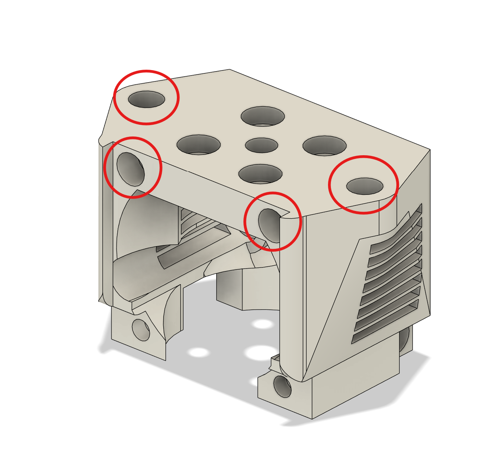
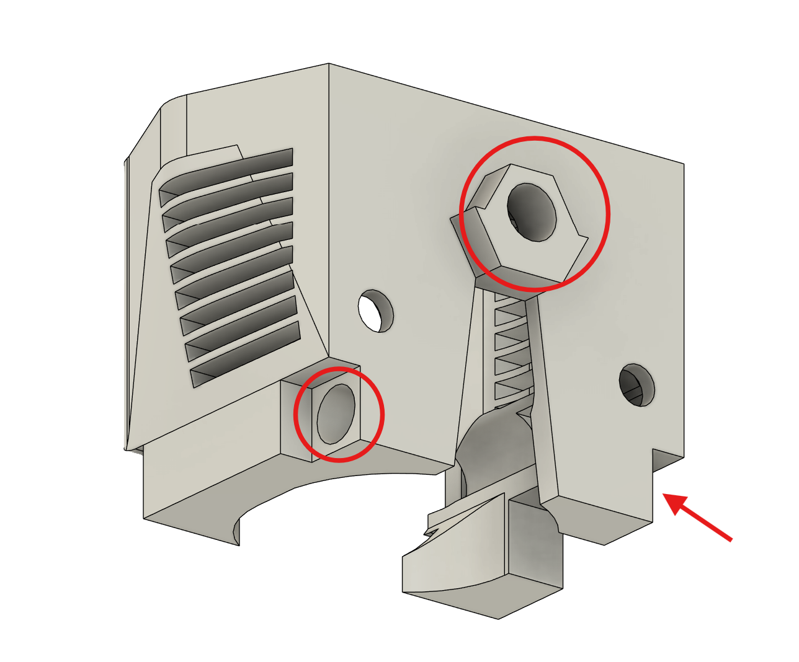

# Vector Toolhead

The vector toolhead is an ultra high-performance toolhead designed for the Voron 0.2 as well as various [Printers for Ants](https://3dprintersforants.com/).

It has been specifically designed for the Goliath Air V2 toolhead menufactured by Mellow (available on [Aliexpress](https://www.aliexpress.us/item/3256805112047958.html) and other retailers) as well as the Orbiter V2.0 from LDO Motors. Such a configuration allows for maximum flowrate up to 110mm3/s. 

It uses a CNC-machined X-carriage backplate (available [here](https://www.aliexpress.us/item/3256803869616066.html?spm=a2g0o.order_detail.order_detail_item.3.4174f19cNWRwPC&gatewayAdapt=glo2usa)), which helps with the overall rigidity of the toolhead. Note that a skeleton X-beam is **not** recommended for ultra high-speed printing, as the reduction in torsional stiffness leads to a noticeable decrease in print quality. 

The toolhead is designed to be used with auxiliary fans, meaning that there are no part cooling fans onboard, but instead rely on a stationary-mounted auxiliary fan system such as the [V0 Auxiliary Fan](https://github.com/JackJack3231/V0-Auxiliary-Fan) mod by JackJack3231. Such a configuration reduces wiring complexity as well as moving mass, which allows for higher accelerations. 

**Unfortunately, this also means that the Vector toolhead is incompatible for printers that use a flying gantry, such as the [F-Zero](https://github.com/zruncho3d/f-zero) and the [Micron](https://github.com/PrintersForAnts/Micron). (unless you can get the aux fan to move with a flying gantry)** 

Optionally, for improved torque and motor support, the [Voron V0.2 Nema 17 Mount](https://www.printables.com/model/494742-voron-v02-nema-17-mount) by redirector allows for the installation of larger Nema 17 motors that is able to handle higher current and output more torque. 

# BOM

| Component | Quantity | Link |
| -------- | ------- | ------ |
| Goliath Air V2 | 1 | [Aliexpress](https://www.aliexpress.us/item/3256805112047958.html)|
| X-gantry Backplate | 1 | [Aliexpress](https://www.aliexpress.us/item/3256803869616066.html?spm=a2g0o.order_detail.order_detail_item.3.4174f19cNWRwPC&gatewayAdapt=glo2usa)
| M3 Heatset Inserts | 7 | [Amazon](https://www.amazon.com/dp/B0CDH36ZMX?ref_=ppx_hzsearch_conn_dt_b_fed_asin_title_1)
| M3 Nuts and Bolts | 1 | [Amazon](https://www.amazon.com/dp/B07L65DHV6?ref_=ppx_hzsearch_conn_dt_b_fed_asin_title_2) |
| 3007 24V Fan | 1 | [Aliexpress](https://www.aliexpress.us/item/3256804799089065.html?spm=a2g0o.productlist.main.1.44345cb6Ubwbsv&algo_pvid=6691419b-6759-4551-98fd-a6cfd562c38b&algo_exp_id=6691419b-6759-4551-98fd-a6cfd562c38b-0&pdp_npi=4%40dis%21USD%214.78%214.30%21%21%214.78%214.30%21%402103146f17359745942747782e4b27%2112000031244803758%21sea%21US%214106347330%21X&curPageLogUid=4MSdai7EV0NV&utparam-url=scene%3Asearch%7Cquery_from%3A)

# Installation and Assembly

Needless to say, this hotend assembly should be printed using ABS, which has a deformation temperature high enough for the needs of a 3D printer hotend. 

First, apply the 7 Heatset Inserts to the positions indicated below. Secure the cowling to the X-gantry backplate before continuing. Then, use the four screws provided with your Goliath Air, and secure it to the main cowling, ensuring that the thermistor wires and heater coil cables run out through the rectangular section on the left of the cowling. 

Secure the side air ducts to the main cowling, then fit the 3007 fan over the front, ensuring that the screw holes line up. Be careful not to overtighten the two bottom screws so that you do not strip the plastic. The heater and thermistor cables should run above the left air duct piece, exiting upwards and joining your wiring harness. 

